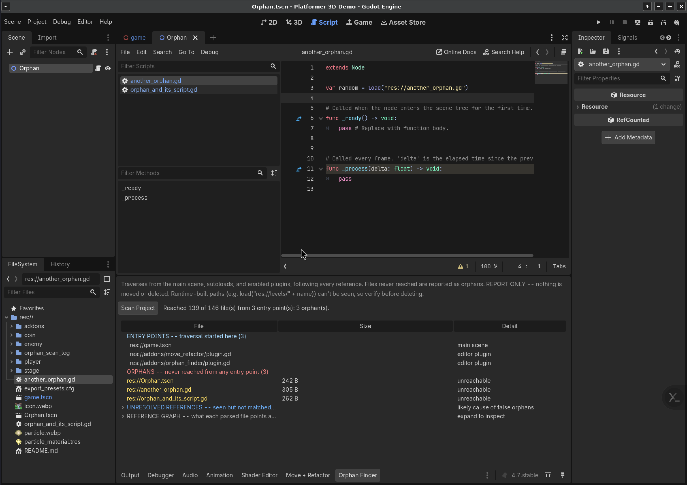
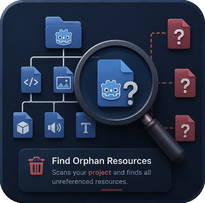

# Godot-Orphan-Finder
# Disclamer this was all coded acording to my prompts with claude AI with some manual fixes 

## Created Addon to search orphan files leftover in Godot projects

We do a tree traversal starting from main scene and so on... addons and autoloaded scripts should be also acounted for and fully explored.
Double clicking on the files shown will show them on the editor
This also genereates a log file with all orphans found

